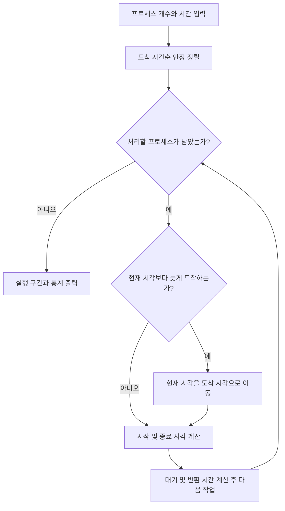

# 01. 설계와 FCFS 원리

[README](../README.md) · [다음: 코드 분석](02-code-walkthrough.md)

이 문서는 V1에서 도입한 FCFS 설계를 설명합니다.
V2의 SJF 선택 규칙과 모듈 분리는 [V2 상세 분석](06-ver2-sjf.md)을 참고하세요.

## 1. 해결하려는 문제

CPU가 하나일 때 여러 프로세스가 도착하면 실행 순서를 정해야 합니다.
V1은 도착 순서대로 처리하는 FCFS를 구현하고, 그 선택이 대기 시간에 어떤 영향을 주는지 계산합니다.
프로그램의 핵심은 화면 출력보다 **시간을 일관되게 계산하는 규칙**입니다.

입력은 프로세스 개수와 각 프로세스의 도착 시간·실행 시간입니다.
출력은 실행 구간, 유휴 구간, 시작·종료·대기·반환 시간입니다.
실제 CPU 점유율을 측정하거나 운영체제 설정을 변경하지 않습니다.

## 2. 모델의 가정

| 항목 | V1의 규칙 | 의미 |
| --- | --- | --- |
| CPU | 1개 | 두 프로세스는 동시에 실행되지 않음 |
| 실행 구간 | 프로세스당 1개 | I/O 대기 후 다시 실행하는 상황 없음 |
| 선점 | 없음 | 실행 중 더 짧은 작업이 도착해도 계속 실행 |
| 문맥 교환 | 비용 0 | 교체에 추가 시간을 더하지 않음 |
| 동시 도착 | 입력 순서 우선 | 같은 입력에 같은 결과를 보장 |
| 시간 | 정수 가상 tick | 실제 시간만큼 기다리지 않음 |

FCFS의 비선점 특성과 대기·반환 시간의 의미는
[UIC 운영체제 수업 자료](https://www.cs.uic.edu/~jbell/CourseNotes/OperatingSystems/6_CPU_Scheduling.html)를 참고할 수 있습니다.
이 문서의 구현 선택과 수치 예제는 이 저장소의 코드를 기준으로 설명합니다.

## 3. 데이터 표현

[`Process`](../src/scheduler.h)는 ID와 시간 관련 값들을 묶는 구조체입니다.

| 필드 | 입력/계산 | 의미 |
| --- | --- | --- |
| `id` | 자동 생성 | 입력 순서에 따라 부여되는 식별자 |
| `arrival_time` | 입력 | 준비 상태가 되는 시각 |
| `burst_time` | 입력 | 필요한 CPU 실행 시간 |
| `start_time` | 계산 | 실제로 처음 실행되는 시각 |
| `completion_time` | 계산 | 실행을 끝낸 시각 |
| `waiting_time` | 계산 | 도착 후 실행까지 기다린 시간 |
| `turnaround_time` | 계산 | 도착부터 완료까지의 전체 시간 |

V1은 최대 100개의 고정 배열을 사용합니다. 개수가 작고 상한이 정해져 있어
동적 메모리의 할당·해제보다 계산 흐름에 집중할 수 있습니다.
ID도 구조체와 함께 이동하므로 정렬 후에도 원래 입력한 작업을 구분할 수 있습니다.

## 4. 실행 흐름



계산이 끝난 구조체를 이용해 출력하므로, 정렬·계산 코드가 표 출력 형식에 의존하지 않습니다.
`IDLE` 구간은 이전 종료와 다음 시작 사이의 차이로 출력 단계에서 복원합니다.

## 5. 시간 계산식

프로세스 i의 도착을 Aᵢ, 실행 시간을 Bᵢ, 시작을 Sᵢ, 종료를 Cᵢ라고 합니다.
정렬된 첫 작업을 처리하기 전 현재 시각은 0입니다.

```text
Sᵢ = max(현재 시각, Aᵢ)
Cᵢ = Sᵢ + Bᵢ
Wᵢ = Sᵢ - Aᵢ
Tᵢ = Cᵢ - Aᵢ = Wᵢ + Bᵢ
현재 시각 = Cᵢ
```

평균 대기는 ΣWᵢ/n, 평균 반환은 ΣTᵢ/n입니다.
현재 모델에서는 한 번 실행되면 끝나기 때문에 `시작 - 도착`이 전체 대기 시간이 됩니다.
Round Robin처럼 여러 번 기다리는 모델에서는 이 식을 그대로 쓰면 안 됩니다.

## 6. 정렬 선택과 복잡도

삽입 정렬에서 기존 값의 도착 시간이 새 값보다 **클 때만** 뒤로 이동합니다.
같은 값은 이동하지 않으므로 동시 도착의 입력 순서가 보존됩니다.

- 최악의 정렬 시간: O(n²).
- 정렬된 입력의 정렬 시간: O(n).
- 시뮬레이션 및 출력: O(n).
- 프로세스 저장량: n에 비례. 실제 코드는 100개를 항상 확보.
- 정렬 보조 공간: 구조체 한 개, O(1).

100개 역순 입력은 최대 4,950번의 앞선 원소 이동으로 정렬됩니다.
이 제한에서는 단순하고 안정적인 구현을 선택한 것입니다.
큰 입력으로 확장한다면 안정적인 O(n log n) 정렬을 검토할 수 있습니다.

## 7. 정확성을 확인할 조건

각 프로세스에서 `시작 >= 도착`, `종료 = 시작 + 실행`, `대기 >= 0`,
`반환 = 대기 + 실행`이 성립해야 합니다.
연속한 실행 구간은 겹치지 않아야 하며 틈이 있으면 `IDLE`이어야 합니다.
도착 시간이 감소하는 실행 순서나 동시 도착의 ID 역전이 있으면 FCFS 규칙 위반입니다.

이 조건들과 별개로 [테스트](04-testing.md)는 독립적인 시간 단위 모델과 실제 결과를 비교합니다.
