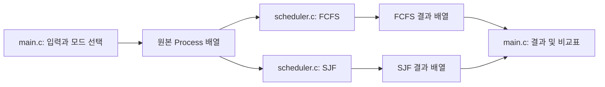

# 06. ver2 — 비선점 SJF와 FCFS 비교 분석

[README](../README.md) · [테스트](04-testing.md) · [다음 버전 계획](05-roadmap.md)

이 문서는 V2 학습 기록입니다. [v2.0.0 소스](https://github.com/jdonghyeon462-cloud/cpu-scheduling-simulator-v2/tree/main)를 기준으로 설명합니다.
현재 V3에서는 비교 모드에 RR과 평균 응답 시간을 추가했습니다. [V3 분석](07-ver3-round-robin.md)을 참고하세요.

## 1. V1에서 무엇이 달라졌는가?

V1은 입력을 도착 순서로 정렬한 뒤 FCFS 결과를 계산했습니다.
V2는 **CPU가 비는 시점마다 도착한 작업 중에서 선택하는 SJF**를 추가합니다.
한 번 입력하면 같은 작업에 대한 두 실행 결과와 평균 비교표를 볼 수 있습니다.

| 항목 | V1 | V2 |
| --- | --- | --- |
| 알고리즘 | FCFS | FCFS, 비선점 SJF |
| 실행 방법 | 옵션 없는 콘솔 실행 | 기존 실행 + 알고리즘 옵션 + 메뉴 |
| 결과 | FCFS 실행 순서·시간 | 각 알고리즘 결과 + 동일 입력 비교표 |
| 코드 | main.c 한 파일 | main.c, scheduler.h, scheduler.c |
| 입력 파일 | 개수 → 도착·실행 반복 | 동일한 형식 유지 |
| 완성본 | v1.0.0 | v2.0.0 |

저장소와 로컬 프로젝트 폴더 이름의 `ver1`은 기존 주소를 보존하기 위해 유지했습니다.
프로그램 제목·README·CHANGELOG·릴리스 태그는 V2를 표시합니다.

## 2. SJF의 선택 조건

SJF(Shortest Job First)는 선택 후보 중 필요한 실행 시간이 가장 짧은 작업을 선택합니다.
이 구현의 후보는 다음 두 조건을 모두 만족해야 합니다.

```text
아직 완료하지 않았다.
도착 시간 <= 현재 시각이다.
```

후보가 여러 개라면 실행 시간, 도착 시간, 입력 순서 순으로 비교합니다.
작업을 고른 뒤에는 끝날 때까지 실행합니다. 따라서 실행 도중 더 짧은 작업이 도착해도 교체하지 않습니다.
입력으로 정확한 CPU 실행 시간을 미리 알고 있다는 교육용 가정이 있습니다.

## 3. 전체 작업을 실행 시간으로 정렬하면 안 되는 이유

[`sjf-future.txt`](../examples/sjf-future.txt)의 입력은 다음과 같습니다.

| 작업 | 도착 | 실행 |
| --- | ---: | ---: |
| P1 | 0 | 4 |
| P2 | 10 | 1 |
| P3 | 0 | 6 |

전체 실행 시간만 정렬하면 아직 도착하지 않은 P2가 맨 앞에 옵니다.
올바른 SJF는 다음과 같습니다.

```text
[0, 4) P1
[4, 10) P3
[10, 11) P2
```

시각 4에는 P3가 준비되어 있으므로 P2를 기다리며 일부러 쉬지 않습니다.
시각 10에 도착한 P2는 그 시각에 완료한 P3 다음에 바로 실행됩니다.

## 4. 코드 구조와 원본 보존



[`scheduler.h`](../src/scheduler.h)는 `Process`, `Algorithm`, `ScheduleStats`와 공개 함수 선언을 모읍니다.
[`scheduler.c`](../src/scheduler.c)는 입력이나 화면 출력 없이 계산만 담당합니다.
[`main.c`](../src/main.c)는 입력 검증, CLI·메뉴, 실행 구간과 비교표를 담당합니다.

### simulate_schedule

```c
int simulate_schedule(const Process input[], int count,
                      Algorithm algorithm, Process output[]);
```

입력 개수·시간 범위·알고리즘을 검사한 뒤 해당 계산 함수를 호출합니다.
입력과 출력은 각각 count개 이상을 담는 **별도 배열**이어야 합니다.
출력은 실행 순서이며 원본 입력은 바꾸지 않습니다. 성공은 1, 잘못된 입력은 0입니다.

FCFS는 원본을 결과 배열에 복사한 뒤 그 복사본을 안정 정렬합니다.
SJF는 원본 순서를 유지한 채 완료 여부를 별도 배열로 관리하고,
선택한 작업을 결과 배열의 다음 위치에 복사합니다.
비교 모드에서 FCFS를 먼저 호출해도 SJF의 입력 순서가 바뀌지 않는 이유입니다.

### simulate_sjf

1. 완료되지 않은 원소를 앞에서부터 훑습니다.
2. 아직 도착하지 않은 원소는 후보에서 제외하고 가장 빠른 다음 도착만 기록합니다.
3. 준비된 원소 중 실행 시간 → 도착 순으로 더 앞서는 원소를 선택합니다.
4. 둘 다 같으면 기존 선택을 유지해 입력 순서를 보존합니다.
5. 후보가 없으면 다음 도착 시각으로 이동해 다시 선택합니다.
6. 후보가 있으면 끝까지 실행하고 완료 표시를 합니다.

동률 판단에 `id`의 숫자 크기를 쓰지 않습니다.
콘솔에서는 ID가 입력 순서와 같지만, 함수에 ID 40·30·10 같은 순서로 넘겨도
동률은 배열의 입력 순서를 따라야 합니다. C 코어 테스트가 이 차이를 확인합니다.

### finish_process와 schedule_stats

`finish_process`는 두 알고리즘의 공통 시간 계산을 담당합니다.

```text
종료 = 시작 + 실행
대기 = 시작 - 도착
반환 = 종료 - 도착
```

`schedule_stats`는 64비트 정수로 합산한 뒤 실수 평균을 계산합니다.
개별 결과 표와 비교표가 같은 통계 함수를 사용하므로 계산 방식이 갈라지지 않습니다.
이 함수에는 성공적으로 계산된 실행 순서의 결과 배열을 전달합니다.

## 5. 같은 입력으로 비교하기

프로젝트 루트에서 실행합니다.

```powershell
pwsh -File scripts/run.ps1 -Algorithm compare -Example sjf-comparison
```

입력은 P1=(도착 0, 실행 5), P2=(1, 4), P3=(2, 1)입니다.

| 방식 | 작업 | 시작 | 종료 | 대기 | 반환 |
| --- | --- | ---: | ---: | ---: | ---: |
| FCFS | P1 | 0 | 5 | 0 | 5 |
| FCFS | P2 | 5 | 9 | 4 | 8 |
| FCFS | P3 | 9 | 10 | 7 | 8 |
| SJF | P1 | 0 | 5 | 0 | 5 |
| SJF | P3 | 5 | 6 | 3 | 4 |
| SJF | P2 | 6 | 10 | 5 | 9 |

```text
FCFS: 0 -- P1 -- 5 -- P2 -- 9 -- P3 -- 10
SJF : 0 -- P1 -- 5 -- P3 -- 6 -- P2 -- 10
```

평균 대기는 FCFS `(0+4+7)/3 = 3.67`, SJF `(0+3+5)/3 = 2.67`입니다.
평균 반환은 각각 `21/3 = 7.00`, `18/3 = 6.00`입니다.
프로그램의 차이값은 `FCFS 평균 대기 - SJF 평균 대기`이므로 여기서는 **1.00**입니다.
양수면 이 입력에서 SJF의 평균 대기가 더 작고, 음수면 FCFS의 평균 대기가 더 작다는 뜻입니다.

## 6. 평균과 개별 대기를 함께 보기

[`sjf-tradeoff.txt`](../examples/sjf-tradeoff.txt)는 P1=(0, 5), P2=(0, 4), P3=(5, 1)입니다.

| 방식 | 실행 순서 | P1 대기 | P2 대기 | P3 대기 | 평균 대기 |
| --- | --- | ---: | ---: | ---: | ---: |
| FCFS | P1 → P2 → P3 | 0 | 5 | 4 | 3.00 |
| SJF | P2 → P1 → P3 | 4 | 0 | 4 | 2.67 |

평균은 줄었지만 P1의 대기는 0에서 4로 늘었습니다.
또한 SJF에서 P3가 시각 5에 도착해도 이미 실행 중인 P1을 중단하지 않아 P3는 9까지 기다립니다.
이 프로젝트는 유한한 입력 작업을 모두 완료합니다. 무한한 작업 유입이나 실제 OS의 공정성을 검증한 것은 아닙니다.

## 7. 비용과 한계

SJF는 각 선택마다 최대 n개를 확인해 O(n²) 시간입니다.
유휴 구간도 다음 도착으로 건너뛰므로 큰 시간 값을 입력했다고 그만큼 반복하지 않습니다.
완료 표시와 두 결과 배열은 작업 수에 비례하는 저장 공간을 사용하며, 실제 배열 상한은 100입니다.

V2의 목적은 제한된 크기에서 선택 조건을 쉽게 읽고 검증하는 것입니다.
대규모 작업 목록에서는 도착 순서 관리와 우선순위 큐를 이용하는 개선을 검토할 수 있습니다.
이 버전에는 I/O 대기, 문맥 교환 비용, 선점, 실행 시간 예측, 그래픽 화면이 없습니다.

## 8. V3로 이어지는 지점

V2까지는 작업 하나가 결과 배열에서 실행 구간 하나를 가집니다.
Round Robin에서는 같은 프로세스가 여러 번 실행되므로 결과 구조를 실행 구간 목록으로 확장해야 합니다.
계산 모듈을 분리했으므로 CLI와 입력 검증을 유지하면서 새 알고리즘을 추가할 수 있습니다.
구체적인 계획은 [버전별 개발 계획](05-roadmap.md)에 있습니다.
